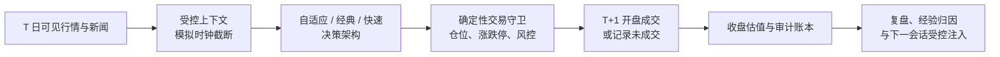
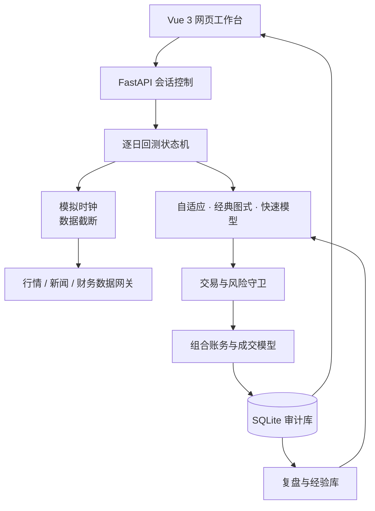

# 知行交易台 / ZenTrade

> A 股优先的 LLM 辅助逐日回测与审计工作台（A-share-first, auditable LLM backtesting workspace）

**当前公开版本：Research Preview / V0.1。** ZenTrade 不是从零开始的独立交易框架，而是基于 [TauricResearch/TradingAgents](https://github.com/TauricResearch/TradingAgents) 的二次开发与研究扩展：复用其多智能体研究图、LLM 与数据供应商接入、CLI 和基础研究能力；本仓库重点新增并维护 A 股优先的逐日回测引擎、低调用决策架构、成交时序、反追涨杀跌护栏、审计记录和网页工作台。

它的目标不是承诺收益，而是将“当日可见信息 → 受约束决策 → 下一交易日成交 → 收盘估值”的过程保留为可检查记录，让策略、模型行为和风险都能够被复盘。上游研究论文为 [*TradingAgents: Multi-Agents LLM Financial Trading Framework*](https://arxiv.org/abs/2412.20138)（Yijia Xiao、Edward Sun、Di Luo、Wei Wang，2025）。本仓库保留上游署名及 [Apache License 2.0](LICENSE)；分发衍生版本时也应保留适用的版权、署名和许可声明。

## 一眼看懂

| 输入 | 系统实际做什么 | 输出 |
| --- | --- | --- |
| 股票、初始资金、日期区间与决策架构 | 按模拟时钟逐日截断行情、新闻和财务可见性；模型只在需要重新判断时调用 | 每日观点、仓位计划、提示词审计记录与 LLM 调用计数 |
| T 日收盘可见信息 | 在成交前执行 A 股规则、仓位/费用校验、反追涨杀跌和风控约束 | T+1 开盘成交或明确的未成交原因 |
| 已完成会话 | 按执行日与估值日核对账户，输出权益曲线、交易记录、复盘和受控经验 | 可检查的决策日、执行日、估值日、费用、持仓与风险状态 |

核心原则：**程序负责行情时序、成交约束、账务与风险门槛；LLM 只负责在受限上下文中提出观点、目标仓位和理由。**

## 它不是什么

- 不是实盘交易系统，也不会代替人工下单、风控或适当性判断。
- 不是“模型说买就立即按当天收盘成交”的收益展示器；新会话采用 T 日决策、T+1 开盘成交。
- 不是保证收益的选股或投资建议工具；回测不代表未来收益，更不代表真实市场一定可以成交。
- 不是让模型绕过规则自由决定仓位的黑箱：涨跌停、整手、费用、冷静期和风险退出由确定性程序控制。
- 不是完整逐笔撮合系统；停复牌、除权除息、ST 特殊规则、盘口流动性与真实滑点仍属于后续边界。

## 回测闭环



模型不能绕过模拟时钟、A 股交易约束、成交模型、硬止损/止盈、冷静期和账务校验。止损遇跌停开盘无法成交时，会记录为未成交风控单、跳过当日模型调用，并在后续交易日按规则重试；只有实际全仓退出才进入冷静期。

## 系统架构



## 当前完成

| 模块 | 当前能力 | 状态 |
| --- | --- | --- |
| A 股交易约束 | 沪深/创业板/科创板整手规则、涨跌停开盘保护、卖方印花税及确定性账务 | 已完成 |
| 决策架构 | 自适应精简、经典完整 Graph、快速单模型三种模式，可在网页创建会话时选择 | 已完成 |
| 成本与调用控制 | 普通日复用有效观点；必要时才调用模型；自适应模式限制每日调用预算 | 已完成 |
| 反追涨杀跌 | 大幅上涨禁止新追买、大幅下跌禁止模型触发式恐慌减仓、全仓风控退出后两交易日冷静期 | 已完成 |
| 成交时序 | 新会话按 T 日收盘信号、T+1 开盘成交；旧会话保留原口径，避免续跑混用 | 已完成 |
| 审计账本 | 区分决策日、执行日、估值日和执行状态；K 线标记、权益曲线与抽屉可交叉核对 | 已完成 |
| 网页工作台 | 创建、暂停、停止与查看回测；每日操作、完整上下文、复盘报告和经验库 | 已完成 |

## 当前可验收的行为

创建一个 A 股逐日回测后，可验证以下行为：

- 普通日可沿用观点，减少不必要的 LLM 调用；重大消息、技术状态转折或价格区间失效时才重新判断。
- T 日只能读取 T 日及以前的信息；订单使用 T+1 开盘价模拟成交，区间最后一天只做期末估值、不生成无法成交的订单。
- 涨停开盘买入、跌停开盘卖出或无有效开盘成交量都会留下明确的 `unfilled` 状态，而不是虚构成交。
- A 股大涨日的模型买入和大跌日的模型部分恐慌卖出会被执行层拦截；图式、混合与快速路径使用同一成交前守卫。
- 风控清仓后，随后两个交易日记录为“冷静期”，不重新调用模型或入场。

## 本地运行

以下示例适用于 PowerShell 和 Python 3.10+：

```powershell
cd C:\path\to\ZenTrade
python -m venv .venv
.\.venv\Scripts\Activate.ps1
python -m pip install --upgrade pip
pip install -r requirements.txt
pip install -r webapp\requirements-webapp.txt
Copy-Item .env.example .env

Push-Location webapp\frontend
npm install
npm run build
Pop-Location

python -m webapp.run
```

浏览器打开 `http://127.0.0.1:8000`。开发前端时可在 `webapp/frontend` 执行 `npm run dev`。

## 开发验证

```powershell
# 后端核心回归
.\.venv\Scripts\python.exe -m pytest -q `
  tests/test_webapp_anti_churn.py `
  tests/test_webapp_next_open.py `
  tests/test_webapp_architecture_modes.py `
  tests/test_webapp_hardening.py `
  tests/test_webapp_adaptive_agent.py `
  tests/test_webapp_architecture_ui.py

# 前端构建
Push-Location webapp\frontend
npm run build
Pop-Location
```

## 数据与安全边界

- 项目仅用于研究、工程验证和回测复盘，不构成投资建议。
- `.env`、API Key、本地 SQLite 会话、模型原始输出、前端依赖和构建产物均不应提交。
- `webapp/data/` 可能包含提示词、持仓与用户输入；发布前必须保持其处于 Git 忽略状态。
- 财务数据不是严格的逐日快照数据库；保守披露滞后可减少前视偏差，但不能完整还原历史修订前的信息。
- 外部行情/模型服务的数据质量、许可证、调用额度、延迟与适用范围需要由使用者自行核实。

## 后续计划

以下项目**尚未实现**，不应被理解为当前能力：

1. 在网页中暴露初始仓位选项，并将新会话默认入场策略调整为更保守、可解释的模式。
2. 接入严格点时（point-in-time）财务数据、除权除息、停复牌、ST/特殊板块规则与更完整交易所状态。
3. 增加可配置滑点、流动性、手续费方案、批量参数实验和基准/非 LLM 策略对照。
4. 增加样本外验证、基准比较、风险归因、会话导出与可复现配置快照。
5. 持续优化 A 股基本面、技术面和事件驱动提示词，并以回归测试约束模型行为。

## 核心目录

```text
webapp/
├── core/       # 组合、账务、成交模型与领域模型
├── engine/     # 模拟时钟、数据网关、决策与逐日回测状态机
├── skills/     # 经验归因、提炼与受控注入
├── store/      # SQLite 会话、每日审计记录与迁移
├── server/     # FastAPI 接口与静态资源服务
├── frontend/   # Vue 3 + Vite 网页界面
└── prompts/    # 决策与复盘提示词
```

## 许可与致谢

本项目按 [Apache License 2.0](LICENSE) 发布，包含并改造了 TradingAgents 的代码与研究思路。感谢原作者 Yijia Xiao、Edward Sun、Di Luo 与 Wei Wang 的开源工作；使用、再发布或分发衍生版本时，请保留适用的版权、署名和许可声明。

